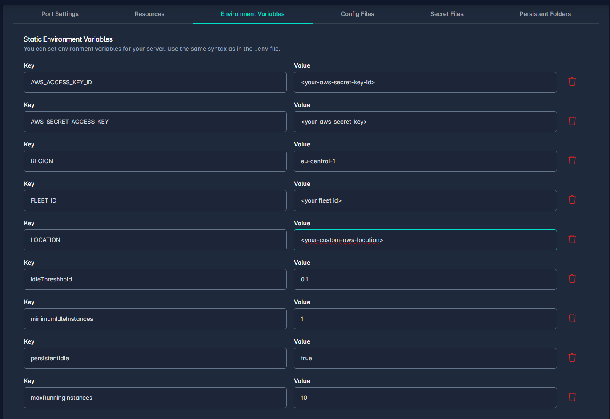

Odin-Fleet Autoscaler

* **Odin Fleet REST-Api**
* **Backend Service**
* **Unreal Engine**

**Odin Fleet REST-Api** 
To get acccess to the Odin Fleet server deployment we need the Odin Fleet [REST-Api](https://docs.4players.io/fleet/api/restapi/) and generate an SDK in you preferred programming language. In you case, we chose typescript to use it in our backendservice later on. To use the SDK we need to specify configuration parameter and set the access-token in its header
```js
const FleetApi = require("@reneup9/odin_fleet_api");
const configID = <your-server-config-id>; //odin fleet server config id
const appID = <your-fleet-appId>; //odin fleet app id
const OdinAccessToken = "<your-access-token>"
let defaultConfig = FleetApi.DefaultConfig

var headers = {
    Authorization: `Bearer ${OdinAccessToken}`,
};
var config = {
    basePath: defaultConfig.basePath,
    headers: {...defaultConfig.headers, ...headers},
    fetchApi: defaultConfig.fetchApi,
    middleware: defaultConfig.middleware,
    queryParamsStringify: defaultConfig.queryParamsStringify,
    username: defaultConfig.username,
    password: defaultConfig.password,
    accessToken: OdinAccessToken,
    credentials: defaultConfig.credentials,
    apiKey: defaultConfig.apiKey,
};

```
This config is used to create severel needed Api classes. 
The next step is to write a few functions to start, deploy and stop server instances

```js
async function startAvailableServerInstanceForApp(appID, serverID){
    let dockerapi = new FleetApi.DockerServiceApi(config);
    let availableServerIds = [];
    if(serverID === undefined){
        availableServerIds = await getAvailableServerIdsForApp(appID);
        if(availableServerIds.length > 0){
            serverID = availableServerIds.readyForGameSession[0];
        }
    }
    await setGameSessionStatusForServer(serverID,"Closed"); //initiate the status of the gamesession as closed 
    await dockerapi.startServer({dockerService:serverID});
    return serverID;
}

async function getAvailableServerIdsForApp(appID){

    let dockerapi = new FleetApi.DockerServiceApi(config);
    const servers = await dockerapi.getServers({app:appID});
        
    let serverList = servers.data;
    let stoppedServersIds = [];
    let runningServerIds = [];
    let serverWithGameServer = [];
    for (let i = 0; i < serverList.length; i++) {
        const element = serverList[i];
        if(element.status == "stopped"){
            stoppedServersIds.push(element.id);
        }else if(element.metadata.gamesSessionStatus == "Available"){
            runningServerIds.push(element.id);
        }else if(element.metadata.gamesSessionStatus == "Started" || element.metadata.gamesSessionStatus == "Starting"){
            serverWithGameServer.push(element.id);  
        }            
    }
    return {stopped:stoppedServersIds,readyForGameSession:runningServerIds,withGameServer:serverWithGameServer,total:servers.data.length,totalRunning:runningServerIds.length +serverWithGameServer.length};
}
```
`startAvailableServerInstanceForApp` starts an existing odin fleet server instance. It takes the Odin Fleet AppId and a serverId as an parameter.
If the serverId is empty we retrieve a serverId for an available instance and use that id. 
To get a better status of the availabillity of the server instance we save the status of gamesession in its metadata.

```
async function setGameSessionStatusForServer(ServerID,Status){
    const dockerApi =new FleetApi.DockerApi(config);    
    await dockerApi.dockerServicesMetadataUpdate({dockerService:ServerID,patchMetadataRequest:{metadata:{gamesSessionStatus:Status}}})
}
```
Evertime a gamesession is started or closed it will be written to the metadata.

Next step is to create new instances if needed. To do that we need to update the location/deployment settings and increase the amount of instances. The new instances are started automatically.

```js
async function createAndStartNewServerInstanceForApp(appId,locationSettingId,maxInstances){

        let locationApi = new FleetApi.AppLocationSettingApi(config);
        let dockerApi = new FleetApi.DockerApi(config);
        let servers = await dockerApi.getServers({app:appId,filterAppLocationSettingId:locationSettingId}); //get servers to check if the maximum amount of instances it reached;
        let serverIDs = [];
        let initialServerCount = servers.data.length;
        let runningServers = 0;
        for (let i = 0; i < servers.data.length; i++) {
            const element = servers.data[i];
            if(element.status == "running"){
                runningServers++;
            }
            serverIDs.push(element.id); //save current server id to check which server id is the id of the new instance
        }
        if(runningServers >= maxInstances){ 
            return {newInstanceID:-1,runningServers:runningServers};
        }
        let locationSettings = await locationApi.getAppLocationSettingById({appLocationSetting:locationSettingId}); //get locationsettings
        if(locationSettings !==  undefined){
            try{
                await locationApi.updateAppLocationSetting({appLocationSetting:locationSettingId,updateAppLocationSettingRequest:{name:locationSettings.name,numInstances:locationSettings.numInstances+1}}); //increase instance count
            }catch(e){ //if the maximum amount of instances due to your payment plan is reached the increase will fail.
                console.log("Increasing instance count failed");
                return {newInstanceID:-2,runningServers:runningServers};
            }
            
            servers = await dockerApi.getServers({app:appId,filterAppLocationSettingId:locationSettingId}); // get the updated list of server instances to figure out which is the newly created one
            let Timeout = false;
            let deltaTime= 0;
            while(servers.data.length == initialServerCount && !Timeout){ // it can take a short time until the new server instance is available
                console.log("Wait for Server");
                await sleep(200);
                deltaTime += 200;
                servers = await dockerApi.getServers({app:appId,filterAppLocationSettingId:locationSettingId});
                if(deltaTime >= 2000){ //set a hard timeout time to prevent an infinit loop if something went wrong during instance creation
                    Timeout = true;
                }
            }
            const newInstances =[];
        
            for (let i = 0; i < servers.data.length; i++) { // compare the `old` instance list with the new one to determine the new instances, we need the new instance id to check when the instance is ready to start a gameinstance. Otherwise the creation of the gameinstance will fail
                console.log(servers.data[i]);
                if(!serverIDs.includes(servers.data[i].id)){
                    await setGameSessionStatusForServer(servers.data[i].id,"Closed");
                    newInstances.push(servers.data[i].id);
                }
            }
            return {newInstanceID:newInstances,runningServers:servers.data.length};
        }
}
```
With this funcition we create and start a new serversinstance and get its id to check the status of that instance. If the instance is ready, we can start a new gamesession. 

Next step is to shutdown server Instances
```js
async function stopServer(serverID){
    let dockerapi = new FleetApi.DockerServiceApi(config);
    await dockerapi.stopServer({dockerService:serverID});
}
```
Evertime a gamesession is closed we will call this to shutdown the server instance.

This are the required basics to implement an scaling logic. We are implement an simple logic where you define a threshold and this sets the started instaces to reduce wating time for instance creation. So everytime a gamesession is requested, tha scaler will check how many new instances needs to be started an how many new instaces are needed. These values will be set as enviroment variables in the server config. 



**idleThreshold** is a percentage value. This amount of running instances is available for upcoming gamesession requests.
**minimumIdleInstances** sets a minimum amount of idle instances.
**persistentIdle** activates the minumum idle instances. 
**maximumRunningInstances** sets a maximum to prevent endless scaling to reduce costs.

```js
async function startServerIfNeeded(appID, locationSettingId){

    let idleThreshhold = 0.0;
    let minimumIdleInstances = 0;
    let persistentIdle = false;
    let maxRunningInstances = 10;
    
    const configApi = new FleetApi.ServerConfigApi(config);
    const serverConfig = await configApi.getServerConfigById({serverConfig:configID});

    for(let i = 0;i < serverConfig.env.length; i++){ //get the environment variables
        const element = serverConfig.env[i];
        switch(element.key){
            case "idleThreshhold":{
                idleThreshhold = element.value;
            }
            case "minimumIdleInstances":{
                minimumIdleInstances = element.value;
            }
            case "persistentIdle":{
                persistentIdle = element.value;
            }
            case "maxRunningInstances":{
                maxRunningInstances = element.value;
            }
        }    
    }       
             
    return createServerInstanceLock.runLocked(async()=>{ //ensure this runs in a locked task to prevent concurrent execution. 
        let availableServerIds = await getAvailableServerIdsForApp(appID,simulate);

        let minIdleInstancesNeeded = Math.floor(availableServerIds.withGameServer.length * idleThreshhold);
        if(availableServerIds.totalRunning >= maxRunningInstances){
            return {created:0, started: 0,available:availableServerIds.readyForGameSession.length};
        }
        if((minIdleInstancesNeeded < minimumIdleInstances) && persistentIdle){
            minIdleInstancesNeeded = minimumIdleInstances;
        }
        minIdleInstancesNeeded++; // at least one instance is always needed because one is needed for the gamesession which is created later
        let newInstancesToCreate = 0;
        let existingInstancesToStart = 0;
        if(availableServerIds.readyForGameSession.length >= minIdleInstancesNeeded){
            return {created:0, started: 0,available:availableServerIds.readyForGameSession.length};// no instance needs to be started, there are alreade enough started instances
        }
        if(availableServerIds.stopped.length >= minIdleInstancesNeeded){
            existingInstancesToStart = minIdleInstancesNeeded;
        }else{
            existingInstancesToStart = availableServerIds.stopped.length;
            newInstancesToCreate = Math.max(minIdleInstancesNeeded - existingInstancesToStart - availableServerIds.readyForGameSession.length,0);
        }

        const startedServerInstancePromises = [];
        for(let i = 0; i < existingInstancesToStart;i++){ //start existing server instances
            startedServerInstancePromises.push(await startAvailableServerInstanceForApp(appID, availableServerIds.stopped[i]));
        }
        const startedServerInstaceIds = await Promise.all(startedServerInstancePromises);
        const createServerInstancesPromises = [];
        for(let i = 0; i< newInstancesToCreate; i++){ //create new instances
            createServerInstancesPromises.push(await createAndStartNewServerInstanceForApp(appID,locationSettingId,maxRunningInstances));
        }
        const createdServerInstanceIds = await Promise.all(createServerInstancesPromises);
        return {created:createdServerInstanceIds, started: startedServerInstaceIds,available:availableServerIds.readyForGameSession.length};
    });
}

```
This will calclulate how many idle instances are needed respecting the environment variables. After that its calculated how many new instances needs to be created and how many existing instances needs to be started and these instances will be created an started.

`createServerInstanceLock` is a  Mutex/AsyncLock which will block the given function for other threads.

```js
class AsyncLock{
    constructor(){
        this._locked = false;
        this._waiters = [];
    }
    async aquire(){
        if(!this._locked){
            this._locked = true;
            return this._release.bind(this);
        }
        return new Promise(resolve => this._waiters.push(resolve)).then(()=> this._release.bind(this));
    }
    _release(){
        const next = this._waiters.shift();
        if(next) next();
        else this._locked = false;
    }

    async runLocked(func){
        const release = await this.aquire(); //wait until other executions are finished and set it locked again
        try{
            return await func(); //call the given function
        }finally{
            release(); // realease it after completion for other calls.
        }
    }
}
const createServerInstanceLock = new AsyncLock();
```

But keep in mind, this will only work instance based. If the scaler runs on multiple instances or in a serverless environment where every function uses its own memory space this approach will not work as intended. If needed, the aquire and release need to store the locked information at some global storage with an atomic operation. Then this will also work on a serverless environment.

**Backend Service**

Now we need to add this to your backendservice and everytime a new gamesession is required the autoscaler is called first. A new serverinstance will get started and/or created if needed. We wait until a instance is available for a gamesession and start it. 


```js
exports.GameLiftQueueGameSession = onRequest({region:GCloudRegion},async (req,res) =>{
    if(req.body.SessionName === undefined){
        res.status(401).send("Missing SessionName");
        return;
    }
    if(req.body.PlacementId === undefined){
        res.status(401).send("Missing PlacementId");
        return;
    }
    const input = {
        PlacementId:req.body.PlacementId,
        GameSessionQueueName: "TestPlacement",
        MaximumPlayerSessionCount: Number(2),
        GameSessionName:req.body.SessionName
    };
    let serverID = await ServerAPI.startServerIfNeeded(appID,locationSettingId,simulate);
    if(serverID.available == 0){ //if no instance is available, wait until an instance is available
        if(serverID == -1){
            res.status(500).send("maximum-running-instances"); 
            return;
        }else if(serverID == -2){
            res.status(500).send("odin-flee-server-maximum"); 
            return;
        }
        await tryUntil(result => result == true,async (s)=>{
            let availableServerIds = await ServerAPI.getAvailableServerIdsForApp(ServerAPI.appID,false);
            if(availableServerIds.readyForGameSession.length >= 1){
                return true;
            }
            return false;
        },5000,120000,serverID);
    }
    
    const command = new StartGameSessionPlacementCommand(input); //start gamesession

    const dbEntry = {
        placementId: input.PlacementId,
        type: "PlacementStarted",
        Name:input.GameSessionName,
        startTime:Timestamp.now(),
        Time:Timestamp.now(),
    }
    await db.collection('GameSessions').doc(input.PlacementId).create(dbEntry);
    
    let result = await executeCommand(res,command,false);
    console.log(result);
    res.status(200).send(result); 
    return;
});
```

Additional we need a few functions to set the status of the gamesession on the server
```js
exports.SetServerActive = onRequest({region:GCloudRegion},async (req,res) =>{
    if(req.body.server_id === undefined){
        res.status(401).send("Missing ServerID");
        return;
    }
    await ServerAPI.setGameSessionStatusForServer(req.body.server_id,"Available");
});


exports.SetServerUsed = onRequest({region:GCloudRegion},async (req,res) =>{   
    if(req.body.server_id === undefined){
        res.status(401).send("Missing ServerID");
        return;
    }
    await ServerAPI.setGameSessionStatusForServer(req.body.server_id,"Started");
});

exports.SetServerShutdown = onRequest({region:GCloudRegion},async (req,res) =>{
    if(req.body.server_id === undefined){
        res.status(401).send("Missing ServerID");
        return;
    }
    await ServerAPI.setGameSessionStatusForServer(req.body.server_id,"Closed");  
    await ServerAPI.stopServer(req.body.server_id);
});
```
`SetServerActive` Is called when the Gamelift initialization is done to mark the server instance as ready for gamesessions.
`SetServerUsed` is called when a gamesession was createdto mark the server as not available for gamesessions anymore.
`SetServerShutdown` is called when a gamesession is closed.


**Unreal Engine**
The last part is to update the server code. We need to call the gamesession-status functions.
```c++
void AOdinFleetGameMode::InitGameLift()
{
#if WITH_GAMELIFT
	UE_LOG(GameServerLog, Log, TEXT("Game Lift initialized"));
	FGameLiftServerSDKModule* GameLiftServerSdkModule = &FModuleManager::LoadModuleChecked<FGameLiftServerSDKModule>(FName("GameLiftServerSDK"));
	Service_Id = FPlatformMisc::GetEnvironmentVariable(TEXT("SERVICE_ID"));
	
	FServerParameters ServerParameters;
	bool bIsAnywhereActive = false;

	FGameLiftGenericOutcome InitSdkOutcome = GameLiftServerSdkModule->InitSDK();
	if (InitSdkOutcome.IsSuccess())
	{
		UE_LOG(GameServerLog, SetColor, TEXT("%s"), COLOR_GREEN);
		UE_LOG(GameServerLog, Log, TEXT("GameLift InitSDK succeeded!"));
		UE_LOG(GameServerLog, SetColor, TEXT("%s"), COLOR_NONE);
	}else
	{
		UE_LOG(GameServerLog, SetColor, TEXT("%s"), COLOR_RED);
		UE_LOG(GameServerLog, Log, TEXT("ERROR: InitSDK failed : ("));
		FGameLiftError GameLiftError = InitSdkOutcome.GetError();
		UE_LOG(GameServerLog, Log, TEXT("ERROR: %s"), *GameLiftError.m_errorMessage);
		UE_LOG(GameServerLog, SetColor, TEXT("%s"), COLOR_NONE);
		return;
	}
	ProcessParameters = MakeShared<FProcessParameters>();

	ProcessParameters->OnStartGameSession.BindLambda([=,this](Aws::GameLift::Server::Model::GameSession InGameSession)
	{
		
		FString GameSessionId = FString(InGameSession.GetGameSessionId());
		UE_LOG(GameServerLog, Log, TEXT("GameSession Initializing: %s"), *GameSessionId);
		GameLiftServerSdkModule->ActivateGameSession();
		UGLBSServiceConnector::SetServerAsUsed(this->Service_Id); //on gamesession creation, set the status of the server
	});
	ProcessParameters->OnUpdateGameSession.BindLambda([=](Aws::GameLift::Server::Model::UpdateGameSession InGameSession)
	{
		UE_LOG(GameServerLog, Log, TEXT("Game SessionUpdating"));
		Aws::GameLift::Server::Model::UpdateReason c = InGameSession.GetUpdateReason();
		Aws::GameLift::Server::Model::GameSession r = InGameSession.GetGameSession();
		return;
	});
	ProcessParameters->OnTerminate.BindLambda([=,this]()
	{
		UE_LOG(GameServerLog, Log, TEXT("Game Server Process is terminating"));
		FGameLiftGenericOutcome processEndingOutcome = GameLiftServerSdkModule->ProcessEnding();

		FGameLiftGenericOutcome destroyOutcome = GameLiftServerSdkModule->Destroy();
		if (processEndingOutcome.IsSuccess() && destroyOutcome.IsSuccess())
		{
			UE_LOG(GameServerLog, Log, TEXT("Server process ending successfully"));
			UGLBSServiceConnector::ShutdownServer(this->Service_Id); //shutdown the server
			//FGenericPlatformMisc::RequestExit(false);
		}else{
			if (!processEndingOutcome.IsSuccess()) {
				const FGameLiftError& error = processEndingOutcome.GetError();
				UE_LOG(GameServerLog, Error, TEXT("ProcessEnding() failed. Error: %s"),
				error.m_errorMessage.IsEmpty() ? TEXT("Unknown error") : *error.m_errorMessage);
			}
			if (!destroyOutcome.IsSuccess()) {
				const FGameLiftError& error = destroyOutcome.GetError();
				UE_LOG(GameServerLog, Error, TEXT("Destroy() failed. Error: %s"),
				error.m_errorMessage.IsEmpty() ? TEXT("Unknown error") : *error.m_errorMessage);
			}
		}
	});


	ProcessParameters->OnHealthCheck.BindLambda([=]()
	{
		UE_LOG(GameServerLog, Log, TEXT("Performing Health Check"));
		return true;
	});


	ProcessParameters->port = FURL::UrlConfig.DefaultPort;
	

	TArray<FString> CommandLineTokens;
	TArray<FString> CommandLineSwitches;

	FCommandLine::Parse(FCommandLine::Get(),CommandLineTokens,CommandLineSwitches);

	for (FString Switch : CommandLineSwitches)
	{
		FString Key;
		FString Value;

		if (Switch.Split("=",&Key,&Value))
		{
		    UE_LOG(GameServerLog, Log, TEXT("KEY: %s"), *Key);
		    UE_LOG(GameServerLog, Log, TEXT("VALUE: %s"), *Value);
			if (Key.Equals("extport"))
			{
				UE_LOG(GameServerLog, Log, TEXT("EXTPORT EXIST"));
				ProcessParameters->port = FCString::Atoi(*Value);
			}
		}
	}
	if (UNetDriver* Driver = GetWorld()->GetNetDriver())
	{
		TSharedPtr<const FInternetAddr> LocalAddr = Driver->GetLocalAddr();
		
		if (LocalAddr.IsValid())
		{
			UE_LOG(GameServerLog, Log, TEXT("PORT %i!"),LocalAddr->GetPort());
		}
	}

	TArray<FString> LogFiles;
	LogFiles.Add(TEXT("OdinFleet/Saved/Logs/server.log"));
	ProcessParameters->logParameters = LogFiles;

	UE_LOG(GameServerLog, Log, TEXT("Calling Process Ready..."));

	FGameLiftGenericOutcome ProcessReadyOutcome = GameLiftServerSdkModule->ProcessReady(*ProcessParameters);

	if (ProcessReadyOutcome.IsSuccess())
	{
		UE_LOG(GameServerLog, SetColor, TEXT("%s"), COLOR_GREEN);
		UE_LOG(GameServerLog, Log, TEXT("Process Ready!"));
		UE_LOG(GameServerLog, SetColor, TEXT("%s"), COLOR_NONE);
		UGLBSServiceConnector::SetServerAsActive(Service_Id); //Set the server as available for gamesessions
	}
	else
	{
		UE_LOG(GameServerLog, SetColor, TEXT("%s"), COLOR_RED);
		UE_LOG(GameServerLog, Log, TEXT("ERROR: Process Ready Failed!"));
		FGameLiftError ProcessReadyError = ProcessReadyOutcome.GetError();
		UE_LOG(GameServerLog, Log, TEXT("ERROR: %s"), *ProcessReadyError.m_errorMessage);
		UE_LOG(GameServerLog, SetColor, TEXT("%s"), COLOR_NONE);
	}
	UE_LOG(GameServerLog, Log, TEXT("InitGameLift completed!"));
	#endif
}
```

These added function calls are calls to our backend service
```c++
void UGLBSServiceConnector::SetServerAsActive(FString ServerID)
{
	TSharedPtr<FJsonObject> JsonData = MakeShared<FJsonObject>();
	JsonData->SetStringField(TEXT("server_id"),ServerID);
	TSharedRef<IHttpRequest, ESPMode::ThreadSafe> Request = GetPostRequest("<your-backend-service-endpoint>",JsonData);
	Request->ProcessRequest();
}

void UGLBSServiceConnector::SetServerAsUsed(FString ServerID)
{
	TSharedPtr<FJsonObject> JsonData = MakeShared<FJsonObject>();
	JsonData->SetStringField(TEXT("server_id"),ServerID);
	TSharedRef<IHttpRequest, ESPMode::ThreadSafe> Request = GetPostRequest("<your-backend-service-endpoint>",JsonData);
	Request->ProcessRequest();
}

void UGLBSServiceConnector::ShutdownServer(FString ServerID)
{
	TSharedPtr<FJsonObject> JsonData = MakeShared<FJsonObject>();
	JsonData->SetStringField(TEXT("server_id"),ServerID);
	TSharedRef<IHttpRequest, ESPMode::ThreadSafe> Request = GetPostRequest("<your-backend-service-endpoint>",JsonData);
	Request->ProcessRequest();
}
```
With this, we created a working autoscaler which can be used independent from GameLift. In this example, we added the autoscaling only to the creation of gamesessions. If Flexmatch/Matchmaking is used, it needs to be added there as well.

