## **Amazon FlexMatch with AnywherFleet, OdinFleet and UnrealEngine**

Requirements
* A dedicated Unreal Engine Gameserver with AWS GameLift
* An Unreal game client with AWS GameLift
* A Backendservice as some kind of Webservice

If you need assistance with one of these, [here]() is a full guid to create these.

Steps in this guide:
* Add matchmaking to the backendservice
* Setup AWS notification channel and subscriptions
* Create a placement queue
* Create matchmaking configuration and ruleset
* Use matchmaking in the game clinet


### Add matchmaking to the backendservice
We are using Firebase Cloud functions as webservice. But any other webservice (node.js or other) will do just fine.
The webservice works as communication layer between the game client and AWS GameLift. The client calls the service, the service communicates with AWS.
To start a matchmaking attempt, we need to call a [StartMatchmakingCommand](https://docs.aws.amazon.com/AWSJavaScriptSDK/v3/latest/client/gamelift/command/StartMatchmakingCommand/) and pass the name of the used matchmaking configuration and the players that are trying to get matched. 

```js
exports.StartFlexMatch = onRequest({region:GCloudRegion},async (req,res)=>{
    if(req.body.PlayerData === undefined){
        res.status(401).send("Missing Playerdata");
        return;
    }
    if(req.body.Config === undefined){
        res.status(401).send("Missing Configuration");
        return;
    }
    const input = { //set the input object
        ConfigurationName:req.body.Config,
        Players: req.body.PlayerData
    };
    const command = new StartMatchmakingCommand(input); 
    await executeCommand(res,command);
});

async function executeCommand(res,command){
    try {
        const response = await gameLiftClient.send(command); //send the command to gamelift
        res.status(200).send(response); 
        return;
    } catch (error) {
        console.error(error);
        if(error instanceof FleetCapacityExceededException){
            res.status(403).send("FleetCapacityExceededException");
        }else{
            res.status(400).send("An error occured");
        }
        return;
    }
}
```
If the client calls this, it returns a JSON-Object with a ticketId. That ticketId will be used to check the status of the matchmaking, we will get into this later on. 
The complete result of the call:
```json
{
   "MatchmakingTicket": { // MatchmakingTicket
     "TicketId": "STRING_VALUE",
     "ConfigurationName": "STRING_VALUE",
     "ConfigurationArn": "STRING_VALUE",
     "Status": "CANCELLED" || "COMPLETED" || "FAILED" || "PLACING" || "QUEUED" || "REQUIRES_ACCEPTANCE" || "SEARCHING" || "TIMED_OUT",
     "StatusReason": "STRING_VALUE",
     "StatusMessage": "STRING_VALUE",
     "StartTime": new Date("TIMESTAMP"),
     "EndTime": new Date("TIMESTAMP"),
     "Players": [ // PlayerList
       { // Player
         "PlayerId": "STRING_VALUE",
         "PlayerAttributes": { // PlayerAttributeMap
           "<keys>": { // AttributeValue
             "S": "STRING_VALUE",
             "N": Number("double"),
             "SL": [ // PlayerAttributeStringList
               "STRING_VALUE",
             ],
             "SDM": { // PlayerAttributeStringDoubleMap
               "<keys>": Number("double"),
             },
           },
         },
         "Team": "STRING_VALUE",
         "LatencyInMs": { // LatencyMap
           "<keys>": Number("int"),
         },
       },
     ],
     "GameSessionConnectionInfo": { // GameSessionConnectionInfo
       "GameSessionArn": "STRING_VALUE",
       "IpAddress": "STRING_VALUE",
       "DnsName": "STRING_VALUE",
       "Port": Number("int"),
       "MatchedPlayerSessions": [ // MatchedPlayerSessionList
         { // MatchedPlayerSession
           "PlayerId": "STRING_VALUE",
           "PlayerSessionId": "STRING_VALUE",
         },
       ],
     },
     "EstimatedWaitTime": Number("int"),
   },
 };
```
The base procedure of AWS Matchmaking:
Client calls `StartMatchmaking` and gets a ticketId

AWS GameLift tries to match with other players for a given time (this is configured in the matchmaking configuration)
GameLift matches other clients that also called `StartMatchmaking`, if the matchmaking configuration and ruleset allow them to get matched.
Clients check the ticketId for the status of the matchmaking. If the matchmaking is successful, it returns the connection info with an ip-address and port.
To check the status the [DescribeMatchmakingCommand](https://docs.aws.amazon.com/AWSJavaScriptSDK/v3/latest/client/gamelift/command/DescribeMatchmakingCommand/) can be used.
But this should only be used for tests since it should not be called continually. To keep track of the ticket status the AWS simple notification service (SNS) should be used.

## Setup AWS notification channel and subscriptions

AWS offers a [notification service](https://docs.aws.amazon.com/sdk-for-javascript/v2/developer-guide/sns-examples.html) called SNS to communicate between AWS products (like GameLift) and a web-endpoint. This can and should be used for several GameLift commands. 

To use notifications you need following:
* Create a notification topic
* Create the endpoint (https for this example)
* Add a subscription


### Create a notification topic
At your AWS dashboard navigate to [Amazon SNS(Simple Notification Service)](https://eu-central-1.console.aws.amazon.com/sns/v3) and Create a new topic.  

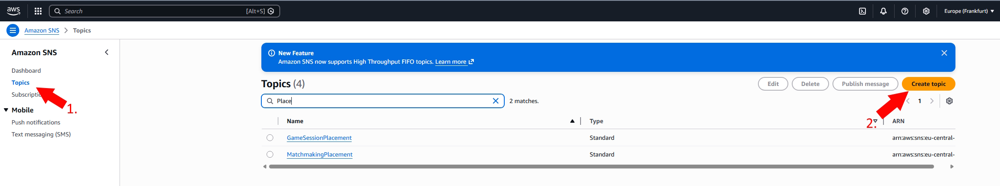  
Set the type to standard, give it a name and the other options can be left at default.

### Create the endpoint
Before we add a subscription to this topic, we create the endpoint which is going to get used. We will use an HTTPS endpoint in our backend service.
```js
exports.MatchmakingPlacement = onRequest({region: GCloudRegion},async (req,res)=>{
    console.log(req.body);
    res.status(401).send("OK");
});
```
To add the subscription, an empty endpoint is enough. You just need to know the correct URL. We will add the necessary code later.

### Add a subscription
After you created the topic you need to add a subscription.
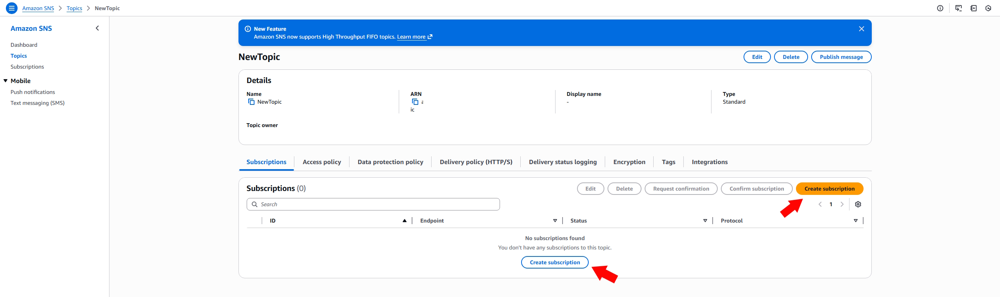  

The subscription defines which delivery protocol is used. AWS SNS supports different protocols (Email,SMS, HTTP, HTTPS and more). For this case we are using the HTTPS protocol. As endpoint for this subscription we use the previously created endpoint in our backend service.
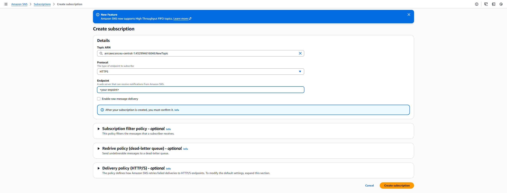

Before this subscription works you need to confirm it. A confirmation request is send after you created it, but you can resend it in the dashboard if needed.
In your empty endpoint implementation we added a log. AWS sends an payload body in following format:
```json
{
  "Message": "You have chosen to subscribe to the topic arn:aws:sns:<location>:<id>:NewTopic.
  To confirm the subscription, visit the SubscribeURL included in this message.",
  "MessageId": "<message-id>",
  "Signature": "<signature>",
  "SignatureVersion": "1",
  "SigningCertURL": "<signing-cert>",
  "SubscribeURL": "<subscription-url>",
  "Timestamp": "<timestamp>",
  "Token": "<token>",
  "TopicArn": "arn:aws:sns:<location>:<id>:NewTopic",
  "Type": "SubscriptionConfirmation",
}
```
You can either get this out of your logs or get the needed information by filtering the Type for **SubscriptionConfirmation** in your endpoint. The important information is the **SubscribeURL**. To confirm the subscription you just need to open that URL.


## Configuration and rule set
#### Rule set
To complete the setup we create the matchmaking configuration and ruleset before we add code to the subscription endpoint. 
Go to your GameLift dashboard to [Matchmaking rule sets](https://eu-central-1.console.aws.amazon.com/gameliftservers/matchmaking-rule-sets) and crete a new matchmaking rule set.
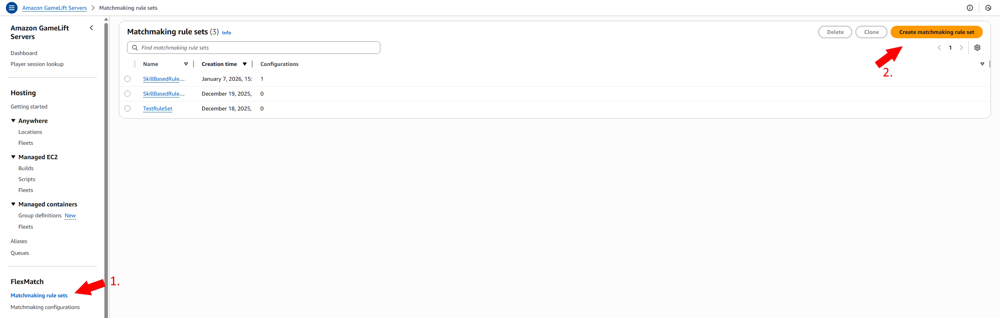
In the next step you need to choose a template. AWS offers some pre defined rule sets you can choose from. In this example we choose "From scratch" and define a very small custom rule set.

Give your rule set a name and fill in the rules as JSON. 
```json
{
  "name": "SkillBasedRuleset",
  "ruleLanguageVersion": "1.0",
  "playerAttributes": [
    { "name": "skill", "type": "number", "default": 1000 },
    { "name": "gamemode", "type": "string" }
  ],
  "teams": [
    { "name": "players", "minPlayers": 2, "maxPlayers": 8 }
  ],
  "rules": [
    {
      "name": "SameGameMode",
      "description": "All players must request the same gamemode",
      "type": "comparison",
      "operation": "=",
      "measurements": [
        "flatten(teams[*].players.attributes[gamemode])"
      ]
    },
    {
      "name": "SkillRange",
      "description": "All players must have similar skill",
      "type": "batchDistance",
      "batchAttribute": "skill",
      "maxDistance": 200
    }
  ]
}
```
This rule set matches players which use the same game mode and have a skill with a maximum distance of 200. These attributes are developer custom and are passed by the game client to the `StartMatchmakingCommand`. These attributes are part of the 'Players' attributes in the input object of the command.
As soon as these rules are satisfied AWS will treat the matchmaking as successful. For example: If you set the minimum players to 1, the rules are satisfied with you as the only searching player and will stop searching for other players since the matchmaking was already successful.
If you want to get more information on how to design a ruleset check the [documentation](https://docs.aws.amazon.com/gameliftservers/latest/flexmatchguide/match-rulesets.html).

#### Gamesession placement queue
When using matchmaking you can choose if either AWS handles the creation of a gamesession, if a match is found, or you can take care of that by yourself. In our case we want to let AWS handle this. For that we need a placement queue. AWS will put a gamesession request in that queue and when that request is on top of the queue and there is capacity on a server, a new gamesession will be created. You can also add a notification to that queue to get the updates on queued and created gamesessions. To create a new queue open the [dashboard](https://eu-central-1.console.aws.amazon.com/gameliftservers/queues) and click create queue.
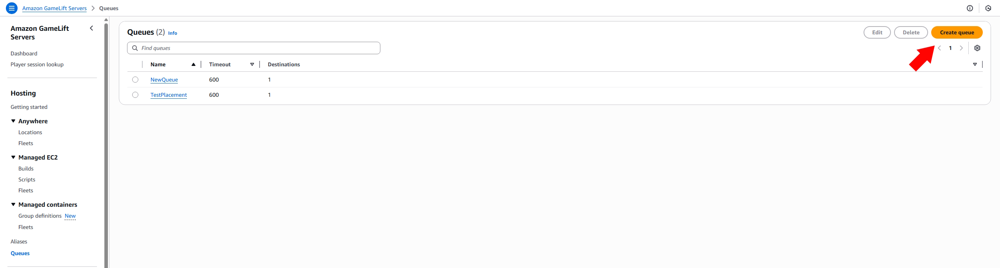
Give the new queue a name and choose a destination order. In the destination order you have to add at least one fleet or alias for a fleet. The queue can add gamesessions to the added destinations. The other settings can be left at default. 
Keep in mind that AWS only handles the creation of the gamesessions. You need to ensure that the gamesession is closed when needed to free the server capacity for other gamesessions. 
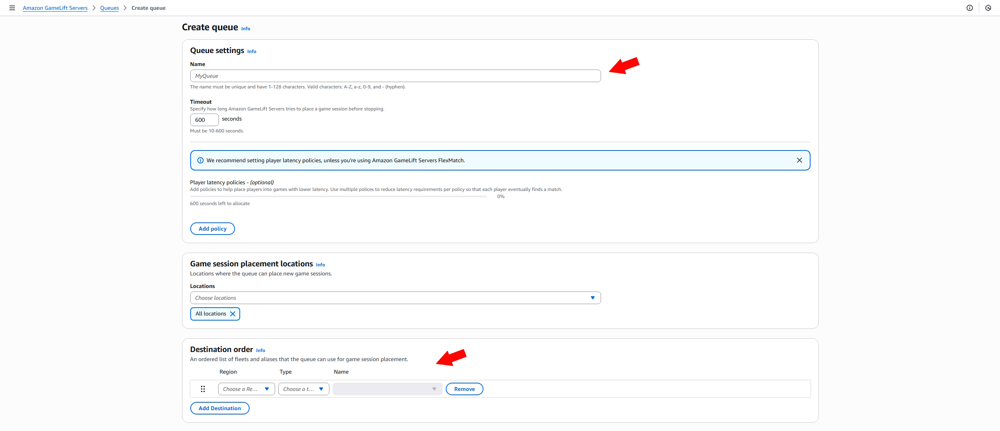

#### Matchmaking configuration
Go to [Matchmaking configurations](https://eu-central-1.console.aws.amazon.com/gameliftservers/matchmaking-configurations), create a new matchmaking configuration, give it a name, select the rule set you want to use and choose Managed as FlexMatch mode and continue. If you choose standalone you need to handle the creation of the gamesession by yourself.
If you chose Managed you need to specify a placement queue. Select the one we created before.
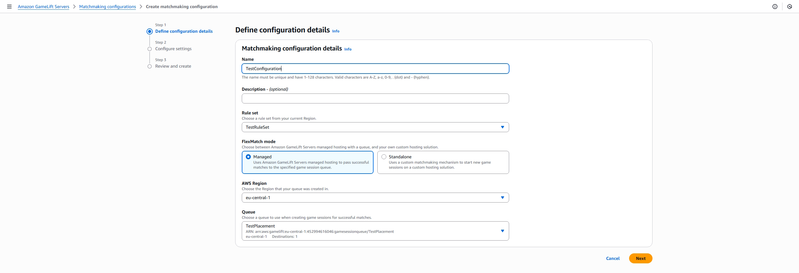

Now we need to specify the configuration settings. 
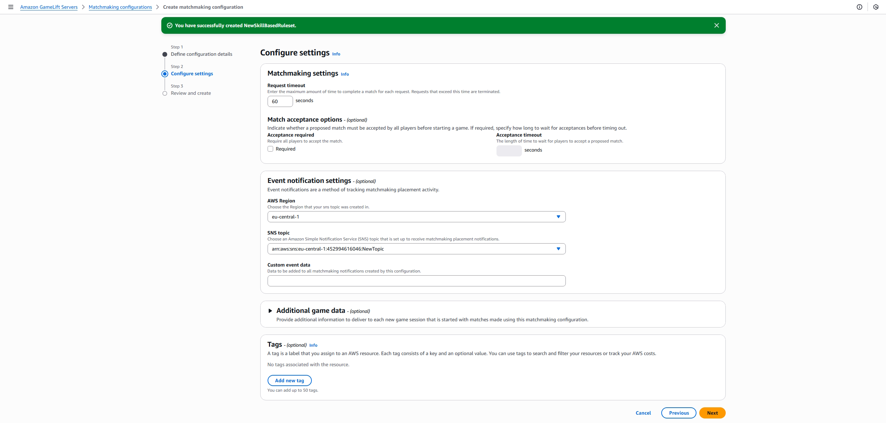
The request timeout is the time AWS tries to match your `StartMatchmaking` call with other players.
If you want players to accept the potentially found match before they can join, you need to check the acceptance required flag. To keep it simple we don't do this.
Important are the event notification settings. Here you specify the previously created notification topic. Select the region where you created the topic and select the topic you want to use.

AWS will sends matchmaking notifications to the subscription you added to the topic.
The body of the notification is a JSON object with following structure.
```json
{
   "version":"0",
   "id":"<id>",
   "detail-type":"GameLift Matchmaking Event",
   "source":"aws.gamelift",
   "account":"<account-id>",
   "time":"2026-01-07T17:54:34.901Z",
   "region":"eu-central-1",
   "resources":[
      "<configuration-arn>"
   ],
   "detail":{
      "tickets":[
         {
            "ticketId":"<ticket1-id>",
            "startTime":"2026-01-07T17:54:28.699Z",
            "players":[
            {
               "playerId":"<player1-id>",
               "playerSessionId":"<player1-session-id>",
               "team":"players"
            }
            ]
         },
         {
            "ticketId":"<ticket2-id>",
            "startTime":"2026-01-07T17:54:32.365Z",
            "players":[
               {
                "playerId":"<player2-id>",
                "playerSessionId":"<player2-session-id>",
                "team":"players"
               }
            ]
         }
      ],
      "type":"MatchmakingSucceeded",
      "gameSessionInfo":{
         "gameSessionArn":"<gamesession-arn>",
         "ipAddress":"<ipAddress>",
         "port":Number(<port>),
         "players":[
            {
               "playerId":"<player1-id>",
               "playerSessionId":"<player1-session-id>",
               "team":"players"
            },
            {
               "playerId":"<player2-id>",
               "playerSessionId":"<player2-session-id>",
               "team":"players"
            }
         ]
      },
      "matchId":"<match-id>"
   }
}
```
Dependent on the type, some of these fields are missing. You can filter following types:
* **MatchmakingSearching:**
A group of at least one player called `StartMatchmaking`
* **PotentialMatchCreated:** 
AWS found players that fullfill the given rules. This can be ignored if the match doesn't need acceptance.
This notification contains all potential players and their ticketId.
* **MatchmakingSucceeded:**
The matchmaking was successful and this notification contains the connection information(ipAddress and port) and all matched players.
If your configuration uses FlexMatch mode Standalone the connection information is not present. You need to handle the creation of the gamesession now.
* **MatchmakingTimedOut:**
The request timed out and no match was found.
* **MatchmakingCancelled:**
The client cancelled matchmacking manually


Now we can add logic to our notification endpoint.
```js
exports.MatchmakingPlacement = onRequest({region:GCloudRegion},async (req,res)=>{
    const snsBody = JSON.parse(req.body);
    console.log(snsBody);
    const message = JSON.parse(snsBody.Message);
    const detail = message.detail;
    switch (detail.type) {
        case "MatchmakingSearching":
            var Tickets = detail.tickets;
            for(let i = 0; i < Tickets.length; i++){
                let element = Tickets[i];
                element.Status = "SEARCHING";
                element.timestamp = Timestamp.now();
                await db.collection('Matchmaking').doc(element.ticketId).create(element);
            }
            break;

        case "PotentialMatchCreated":
            var Tickets = detail.tickets;
            for(let i = 0; i < Tickets.length; i++){
                let element = Tickets[i];
                element.Status = "POTENTIAL_MATCH";
                element.timestamp = Timestamp.now();
                element.matchId = detail.matchId;
                element.acceptanceRequired = detail.acceptanceRequired;
                if(detail.acceptanceRequired == true){
                    await db.collection('Matchmaking').doc(element.ticketId).update(element);
                }                
            }
            break;

        case "MatchmakingSucceeded":
            var Tickets = detail.tickets;
            var gamesessionInfo = detail.gameSessionInfo;
            for(let i = 0; i < Tickets.length; i++){
                var element = Tickets[i];
                element.Status = "MATCHMAKING_SUCCESSFULL";
                element.timestamp = Timestamp.now();
                element.matchId = detail.matchId;
                element.ipAddress = gamesessionInfo.ipAddress;
                element.port = gamesessionInfo.port;
                element.gameSessionArn = gamesessionInfo.gameSessionArn;
                await db.collection('Matchmaking').doc(element.ticketId).update(element);
            }

            break;

        case "MatchmakingTimedOut":
            var Tickets = detail.tickets;
            for(let i = 0; i < Tickets.length; i++){
                var element = Tickets[i];
                element.Status = "TIMEOUT";
                element.timestamp = Timestamp.now();
                await db.collection('Matchmaking').doc(element.ticketId).update(element);
            }
            break;
        case "MatchmakingCancelled":
            var Tickets = detail.tickets;
            for(let i = 0; i < Tickets.length; i++){
                var element = Tickets[i];
                element.Status = "CANCELLED";
                element.timestamp = Timestamp.now();
                await db.collection('Matchmaking').doc(element.ticketId).update(element);
            }
        default:
            break;
    }
    return res.status(200).send("ok");
});
```
This will save the status of each ticket into a database. The client can query his ticketId and keep track of the status of this matchmaking ticket without polling the GameLift api.
If you are using an own webservice based on node.js or similar you can use a websocket connection to forward the notification directly to the client. Firebase does not have an sdk for unreal. Thats the reason we are using a database which can be polled by the client. To keep the communication clean we create a endpoint to check the ticket status. The client calls this endpoint and passes all ticketIds it wants to get checked. The endpoint then checks the ticketIds and returns the status. 
 ```js
 exports.GameLiftCheckMatchmakingTicket = onRequest({region:GCloudRegion},async(req,res) =>{

    if(req.body.TicketIds == undefined){
        res.status(403).send("Missing TicketIds");
        return;
    }
    if(req.body.TicketIds.length == 0){
        res.status(403).send("No TicketIds");
        return;
    }
    const ticketIds = req.body.TicketIds;
    const TicketPromises = [];
    for(let i = 0; i < ticketIds.length; i++){ // iterate through all ticketIds
        TicketPromises.push(db.collection('Matchmaking').doc(ticketIds[i]).get()); // load the tickets from the database
    }
    let Tickets = await Promise.all(TicketPromises);
    let result = {TicketList:[]};
    for (let i = 0; i < Tickets.length; i++) { // add the database value as JSON to an array
        const element = Tickets[i];
        result.TicketList.push(element.data())
    }
    return res.status(200).send(result); 

    //this can be used for testing if the notification is not set up.
    /*var input = { 
        TicketIds:req.body.TicketIds
    };
    const command = new DescribeMatchmakingCommand(input);
    await executeCommand(res,command);*/
});
 ```
 To keep this example simple, this does not contain any checking logic and just returns the whole entries from the database for each given ticketId.

 #### Usage in the game client

 We created all the required structure to use AWS FlexMatch/matchmaking. The last step is to add this to your game client. 
 To add this the client only needs to call 2 functions
 * Call the `StartFlexMatch` endoint to start a matchmaking attempt
 * Periodically call `GameLiftCheckMatchmakingTicket` endpoint to keep track of the ticket status
  
##### StartFlexMatch

We implement this in an c++ function library to expose this to unreal blueprints.
```c++
void UGLBSServiceConnector::StartMatchmaking(FMatchMakingTiketResult OnTicketCreated, FString PlayerId,
	FString GameMode, int32 skillLevel)
{
	TSharedPtr<FJsonObject> PlayerData = MakeShared<FJsonObject>(); // create the input object for the StartMatchmakingCommand
	
	TSharedPtr<FJsonObject> PlayerAttributes = MakeShared<FJsonObject>();
	
	const TSharedPtr<FJsonObject> Skill = MakeShared<FJsonObject>();
	Skill->SetNumberField(TEXT("N"), skillLevel);
	
	const TSharedPtr<FJsonObject> GameModeAttr = MakeShared<FJsonObject>();
	GameModeAttr->SetStringField(TEXT("S"), GameMode);
	
	PlayerAttributes->SetObjectField(TEXT("skill"),Skill);
	PlayerAttributes->SetObjectField(TEXT("gamemode"),GameModeAttr);
	const TSharedPtr<FJsonObject> Latency = MakeShared<FJsonObject>();
	Latency->SetNumberField(TEXT("eu-central-1"),12);  
	
	PlayerData->SetStringField(TEXT("PlayerId"),PlayerId);
	PlayerData->SetObjectField(TEXT("PlayerAttributes"),PlayerAttributes);
	PlayerData->SetObjectField(TEXT("Latency"),Latency);
	TSharedPtr<FJsonObject> JsonData = MakeShared<FJsonObject>();
	
	TArray<TSharedPtr<FJsonValue>> Players;
	Players.Add(MakeShared<FJsonValueObject>(PlayerData));
	JsonData->SetArrayField(TEXT("PlayerData"),Players);
	JsonData->SetStringField(TEXT("Config"),"NewConfiguration"); /// here you should paste the name of your AWS Matchmaking Configuration, this can alse be a parameter
	
	TSharedRef<IHttpRequest, ESPMode::ThreadSafe> Request = GetPostRequest("<your start matchmaking endpoint url>",JsonData);
	Request->OnProcessRequestComplete().BindLambda([OnTicketCreated](FHttpRequestPtr, FHttpResponsePtr Response,bool bOK)
	{
		const FString ResponseString = Response->GetContentAsString();
		TSharedRef<TJsonReader<>> Reader = TJsonReaderFactory<>::Create(ResponseString);
		TSharedPtr<FJsonObject> Json;
		if (!FJsonSerializer::Deserialize(Reader,Json) || !Json.IsValid())/// if no valid JSON is returned
		{
			FMatchmakingTicket data;
			OnTicketCreated.Execute(data,true,EGameLiftExceptionsBP::Exception);
			return;
		}
		if (Json->HasField(FString(TEXT("MatchmakingTicket"))))
		{
			FMatchmakingTicket data;
			TSharedPtr<FJsonValue> GameSessionsJson = Json->GetField(FString(TEXT("MatchmakingTicket")),EJson::Object);
			data = CreateMatchmakingTicketDataFromJson(GameSessionsJson);
			OnTicketCreated.Execute(data,false,EGameLiftExceptionsBP::None);
			return;
		}
		FMatchmakingTicket data;
		OnTicketCreated.Execute(data,false,EGameLiftExceptionsBP::None);
	});
	Request->ProcessRequest();
}
```
This function takes three paramaters as input
* a dynamic delegate which is called when the endpoint delivers an result
* The playerId of the local player 
* The selected gamemode
* The skill value for the player
  
The playerId can be an array. It is possible to start matchmaking for more than one initial player. In that case you need to modify the code to accept an array of ids.
The JsonData object which is created at the beginning of the function has the structure as mentioned in the [AWS Documentation](https://docs.aws.amazon.com/AWSJavaScriptSDK/v3/latest/client/gamelift/command/StartMatchmakingCommand/)
```json
{ // StartMatchmakingInput
  "TicketId": "STRING_VALUE",
  "ConfigurationName": "STRING_VALUE", // required
  "Players": [ // PlayerList // required
    { // Player
      "PlayerId": "STRING_VALUE",
      "PlayerAttributes": { // PlayerAttributeMap
        "<keys>": { // AttributeValue
          "S": "STRING_VALUE",
          "N": Number("double"),
          "SL": [ // PlayerAttributeStringList
            "STRING_VALUE",
          ],
          "SDM": { // PlayerAttributeStringDoubleMap
            "<keys>": Number("double"),
          },
        },
      },
      "Team": "STRING_VALUE",
      "LatencyInMs": { // LatencyMap
        "<keys>": Number("int"),
      },
    },
  ],
}

```
If the call delivers a valid result with a matchmaking ticket it gets parsed to an unreal struct and returned to the caller.
```c++
USTRUCT(Blueprintable,BlueprintType)
struct FMatchmakingTicket
{
	GENERATED_BODY()

	UPROPERTY(BlueprintReadOnly)
	FString TicketId;

	UPROPERTY(BlueprintReadOnly)
	FString ConfigurationName;
	
	UPROPERTY(BlueprintReadOnly)
	FString ConfigurationArn;
	
	UPROPERTY(BlueprintReadOnly)
	FString Status;
	
	UPROPERTY(BlueprintReadOnly)
	FString StatusReason;
	
	UPROPERTY(BlueprintReadOnly)
	FString StatusMessage;
	
	UPROPERTY(BlueprintReadOnly)
	FDateTime StartTime;
	
	UPROPERTY(BlueprintReadOnly)
	FDateTime EndTime;
	
	UPROPERTY(BlueprintReadOnly)	
	TArray<FPlayerData> Players;
	
	UPROPERTY(BlueprintReadOnly)	
	FGameSessionConnectionInfo ConnectionInfo;
};

FMatchmakingTicket UGLBSServiceConnector::CreateMatchmakingTicketDataFromJson(
	const TSharedPtr<FJsonValue>& MatchmakingTicketDataJson)
{
	FMatchmakingTicket data;
	TSharedPtr<FJsonObject> obj = MatchmakingTicketDataJson->AsObject();

	if (obj->HasField(TEXT("TicketId")))
	{
		data.TicketId =obj->GetStringField(TEXT("TicketId"));
	}
	if (obj->HasField(TEXT("ConfigurationName")))
	{
		data.ConfigurationName =obj->GetStringField(TEXT("ConfigurationName"));
	}
	if (obj->HasField(TEXT("ConfigurationArn")))
	{
		data.ConfigurationArn =obj->GetStringField(TEXT("ConfigurationArn"));
	}
	if (obj->HasField(TEXT("Status")))
	{
		data.Status =obj->GetStringField(TEXT("Status"));
	}
	if (obj->HasField(TEXT("StatusReason")))
	{
		data.StatusReason =obj->GetStringField(TEXT("StatusReason"));
	}
	if (obj->HasField(TEXT("StatusMessage")))
	{
		data.StatusMessage =obj->GetStringField(TEXT("StatusMessage"));
	}
	if (obj->HasField(TEXT("StartTime")))
	{
		FDateTime Time;
		FDateTime::ParseIso8601(*obj->GetStringField(TEXT("StartTime")),Time);
		data.StartTime =Time;
	}
	if (obj->HasField(TEXT("EndTime")))
	{
		FDateTime Time;
		FDateTime::ParseIso8601(*obj->GetStringField(TEXT("EndTime")),Time);
		data.EndTime =Time;
	}

	if (obj->HasField(TEXT("GameSessionConnectionInfo")))
	{
		FGameSessionConnectionInfo connectionInfo;
		TSharedPtr<FJsonObject> connectionInfoJson = obj->GetObjectField(TEXT("GameSessionConnectionInfo"));
		if (connectionInfoJson->HasField(TEXT("GameSessionArn")))
		{
			connectionInfo.GameSessionArn =connectionInfoJson->GetStringField(TEXT("GameSessionArn"));
		}
		if (connectionInfoJson->HasField(TEXT("IpAddress")))
		{
			connectionInfo.IPAddress =connectionInfoJson->GetStringField(TEXT("IpAddress"));
		}
		if (connectionInfoJson->HasField(TEXT("DnsName")))
		{
			connectionInfo.DnsName =connectionInfoJson->GetStringField(TEXT("DnsName"));
		}
		if (connectionInfoJson->HasField(TEXT("Port")))
		{
			connectionInfo.Port =connectionInfoJson->GetIntegerField(TEXT("Port"));
		}
		data.ConnectionInfo = connectionInfo;
	}
	return data;
}

```

##### Check ticketId
If the the matchmaking was started successfully you need to check the ticketId to receive the status of that ticket. This works similar to starting the matchmaking. Call the endpoint and parse the result. The function takes a delegate and an array with ticketIds as input and returns an array of unreal structs. 
```c++
void UGLBSServiceConnector::CheckMatchmakingTicket(FDescribeMatchmakingResult OnTicketDescribed,
	TArray<FString> TicketIds)
{
	TSharedPtr<FJsonObject> JsonData = MakeShared<FJsonObject>();
	TArray<TSharedPtr<FJsonValue>> Tickets;
	for (const FString& TicketId : TicketIds)
	{
		Tickets.Add(MakeShared<FJsonValueString>(TicketId));
	}
	
	JsonData->SetArrayField(TEXT("TicketIds"),Tickets);
	TSharedRef<IHttpRequest, ESPMode::ThreadSafe> Request = GetPostRequest("<your-check-ticketId-endpoint>",JsonData);
	Request->OnProcessRequestComplete().BindLambda([OnTicketDescribed](FHttpRequestPtr, FHttpResponsePtr Response,bool bOK)
	{
		const FString ResponseString = Response->GetContentAsString();
		TSharedRef<TJsonReader<>> Reader = TJsonReaderFactory<>::Create(ResponseString);
		TSharedPtr<FJsonObject> Json;
		if (!FJsonSerializer::Deserialize(Reader,Json) || !Json.IsValid())
		{
			TArray<FMatchmakingTicketSubscriptionResult> data;
			OnTicketDescribed.Execute(data,true,EGameLiftExceptionsBP::Exception);
			return;
		}
		if (Json->HasField(FString(TEXT("TicketList"))))
		{
			TArray<FMatchmakingTicketSubscriptionResult> data;
			//TSharedPtr<FJsonValue> GameSessionsJson = Json->GetField(FString(TEXT("TicketList")),EJson::Array);
			TArray<TSharedPtr<FJsonValue>> Tickets = Json->GetArrayField(TEXT("TicketList"));
			for (const TSharedPtr<FJsonValue>& TicketId : Tickets)
			{
				FMatchmakingTicketSubscriptionResult ticketdata;
				const TSharedPtr<FJsonObject> ticketObj = TicketId->AsObject();
				ticketdata.Status = ticketObj->GetStringField(TEXT("Status"));

				TArray<TSharedPtr<FJsonValue>> players = ticketObj->GetArrayField(TEXT("players"));
				for (const TSharedPtr<FJsonValue>& player : players)
				{
					FPlayerData playerData;
					TSharedPtr<FJsonObject> playerObj = player->AsObject();
					playerData.PlayerId = playerObj->GetStringField(TEXT("playerId"));
					if (playerObj->HasField(TEXT("team")))
					{
						playerData.Team = playerObj->GetStringField(TEXT("team"));
					}
					if (playerObj->HasField(TEXT("playerSessionId")))
					{
						playerData.PlayerSessionId = playerObj->GetStringField(TEXT("playerSessionId"));
					}
					ticketdata.Player.Add(playerData);
				}
				if (ticketObj->HasField(TEXT("acceptanceRequired")))
				{
					ticketdata.AcceptanceRequired = ticketObj->GetBoolField(TEXT("acceptanceRequired"));
				}
				if (ticketObj->HasField(TEXT("gameSessionArn")))
				{
					ticketdata.GameSessionArn = ticketObj->GetStringField(TEXT("gameSessionArn"));
				}
				if (ticketObj->HasField(TEXT("ipAddress")))
				{
					ticketdata.IpAddress = ticketObj->GetStringField(TEXT("ipAddress"));
				}
				if (ticketObj->HasField(TEXT("port")))
				{
					ticketdata.Port = ticketObj->GetIntegerField(TEXT("port"));
				}
				if (ticketObj->HasField(TEXT("matchId")))
				{
					ticketdata.MatchId = ticketObj->GetStringField(TEXT("matchId"));
				}
				data.Add(ticketdata);
			}
			OnTicketDescribed.Execute(data,false,EGameLiftExceptionsBP::None);
			return;
		}
		TArray<FMatchmakingTicketSubscriptionResult> data;
		OnTicketDescribed.Execute(data,false,EGameLiftExceptionsBP::None);
	});
	Request->ProcessRequest();
}

USTRUCT(BlueprintType)
struct FMatchmakingTicketSubscriptionResult
{
	GENERATED_BODY()

	UPROPERTY(BlueprintReadOnly)
	FString Status;

	UPROPERTY(BlueprintReadOnly)
	bool AcceptanceRequired = false;

	UPROPERTY(BlueprintReadOnly)
	FString GameSessionArn;

	UPROPERTY(BlueprintReadOnly)
	FString MatchId;

	UPROPERTY(BlueprintReadOnly)
	FString IpAddress;

	UPROPERTY(BlueprintReadOnly)
	int32 Port;

	UPROPERTY(BlueprintReadOnly)
	FString TicketId;

	UPROPERTY(BlueprintReadOnly)
	FString StartTime;

	UPROPERTY(BlueprintReadOnly)
	TArray<FPlayerData> Player;
};
```

##### Blueprint implementation
To use this you just need to call it in an blueprint and start checking the ticketId if the call was successfull. In the following example, every 2 seconds the ticketId is checked. 
<p align="center">
  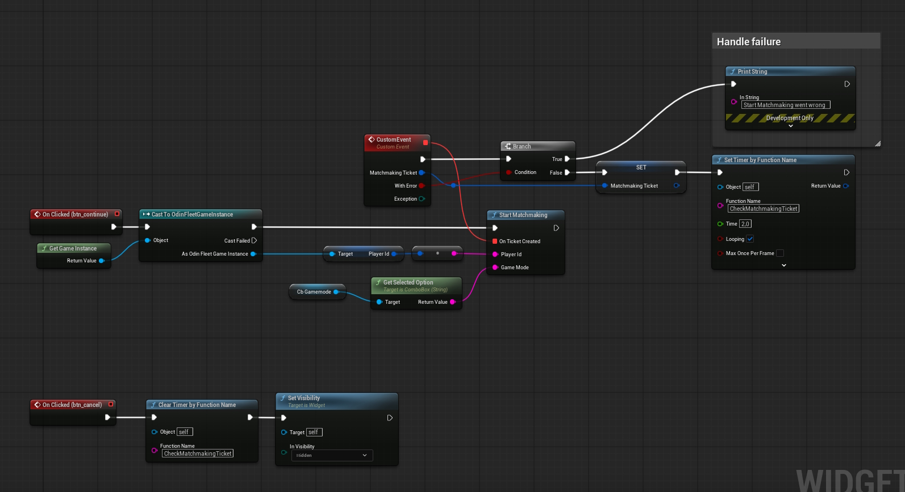
</p>


As we are only handling one ticket at a time, we just create an array with one entry and add the ticketId of the StartMatchmakling result. 
When the endpoint returns the ticket status the passed event is called.
<p align="center">
  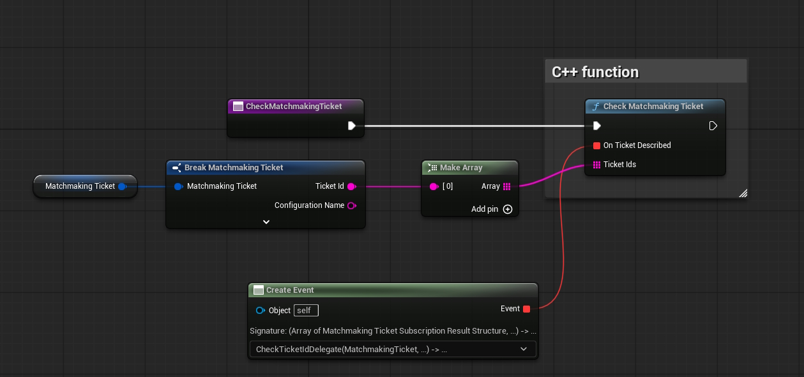
</p>


The passed event delegate:
<p align="center">
  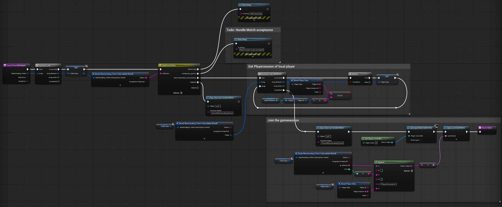
</p>

This iterates through all returned tickets, just one in our case, and if the matchmaking was successfull the player joins the gamesession.
